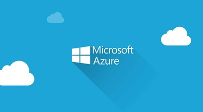

## Introduction

Welcome to this hands-on lab exploring a powerful and scalable web application architecture on Azure! In this lab, you'll learn how to integrate Azure Front Door, API Management (APIM), and App Service to create a robust and globally distributed solution. Azure Front Door acts as a global load balancer, providing high availability and performance. APIM centralizes API management, security, and observability. App Service hosts your web application, providing a fully managed platform. 
This lab will guide you through configuring each service and connecting them to create a secure, scalable, and manageable application. 
You'll learn how to leverage Front Door for TLS offloading and dynamic request acceleration, APIM for API security and traffic management, and App Service for easy deployment and scaling of your web app. 
By the end of this lab, you'll have a solid understanding of how these services work together to build modern cloud applications. 

Get ready to deploy and configure a highly available and performant web application on Azure!

## Lab Architecture Diagram


## Lab Steps

**<u>Login to Azure</u>**

* Login to Azure.
* Check if you're using the correct subscription.

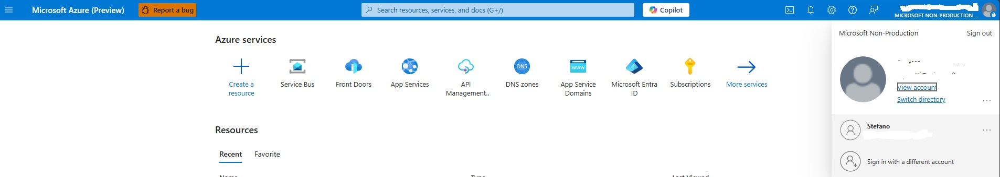


**<u>Create a Resource Group for your Lab</u>**

Create a Resource Group and provide name,select the Region and your subscription to provision it.

For this Lab we'll use **project-integration-001**.

A **resource group** in Azure is a logical container that holds related resources for an Azure solution. 

These resources include virtual machines, databases, and virtual networks, among others. Resource groups help manage and organize resources based on their lifecycle and security.

Once Finished to review all the tabs, **Click Review + create**.

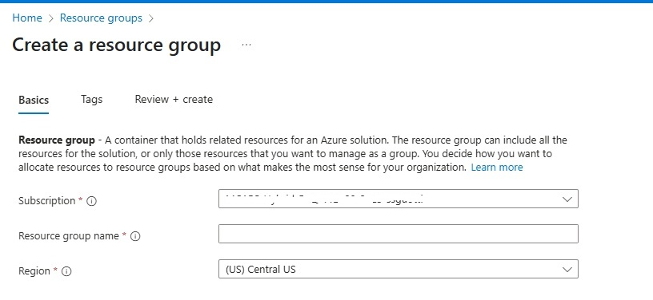


## Start Create your Resources (Azure Front Door,APIM,App Service)

Before to deploy the entire architecture (as described in our Lab Architecture Diagram),our primary focus will be on deploying the following components:

## Overview

| **Service** | **Description** | **Official Documentation** |
|-------------|-----------------|----------------------------|
| **Azure Front Door** | This will serve as the entry point for our application. Azure Front Door is a scalable and secure entry point for fast delivery of your global, mission-critical applications. It provides global load balancing, SSL offloading, and application acceleration to ensure high availability and performance. | [Azure Front Door](https://learn.microsoft.com/en-us/azure/frontdoor/front-door-overview) |
| **API Management (APIM)** | Azure Front Door will route traffic to the APIM, which acts as a gateway to manage, secure, and monitor APIs. | [API Management](https://learn.microsoft.com/en-us/azure/api-management/api-management-key-concepts) |
| **App Service** | The APIM will then route traffic to the App Service, where a REST API is hosted. The App Service provides a fully managed platform for building, deploying, and scaling web applications. | [App Service](https://learn.microsoft.com/en-us/azure/app-service/overview) |

Throughout this lab, you'll learn how to configure each service and connect them to create a secure, scalable, and manageable application. 
By the end of this lab, you'll have a solid understanding of how these services work together to build modern cloud applications.


## Deploy App Service

We're going to deploy our App Service that will host our test REST API. 
For your REST API we're going to use this sample code:

```
const express = require('express');
const app = express();
const port = process.env.PORT || 3000;

// Endpoint di esempio
app.get('/api/users/:id', (req, res) => {
  const userId = req.params.id;
  res.json({
    id: userId,
    name: 'Mario Rossi',
    email: 'mario.rossi@contoso.com'
  });
});

// Avvia il server
app.listen(port, () => {
  console.log(`API simulata in ascolto alla porta ${port}`);
});

```
Source code: [my-app-node](https://github.com/pta19059/my-node-app)

Now let's start to deploy our App service and below I'll provide step-by-step to deploy it integrating the sample code mentioned above.

## Steps

**Provision App Service**

* Go to the Azure Portal --> find **App Service**.

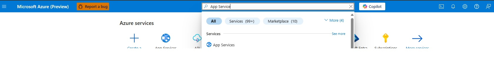

Click on **Create** button and let's start the creation process. 
Select **Web App** on the menu that will appear.
Select Resource Group (**project-integration-001**) , provide a name for your Web App.
In the Runtime Stack --> Select **Node 22 TLS**. OS leaves selected **Linux**.
Select the Region.
In the Pricing Plans --> select **Free F1** for this Lab.
Zone Redundancy leave Disabled for this Lab.
Leave the Default options, only in the Networking part check if **Enable public access** is On.
Then click **Review + create**. Wait until the deployment will be completed.

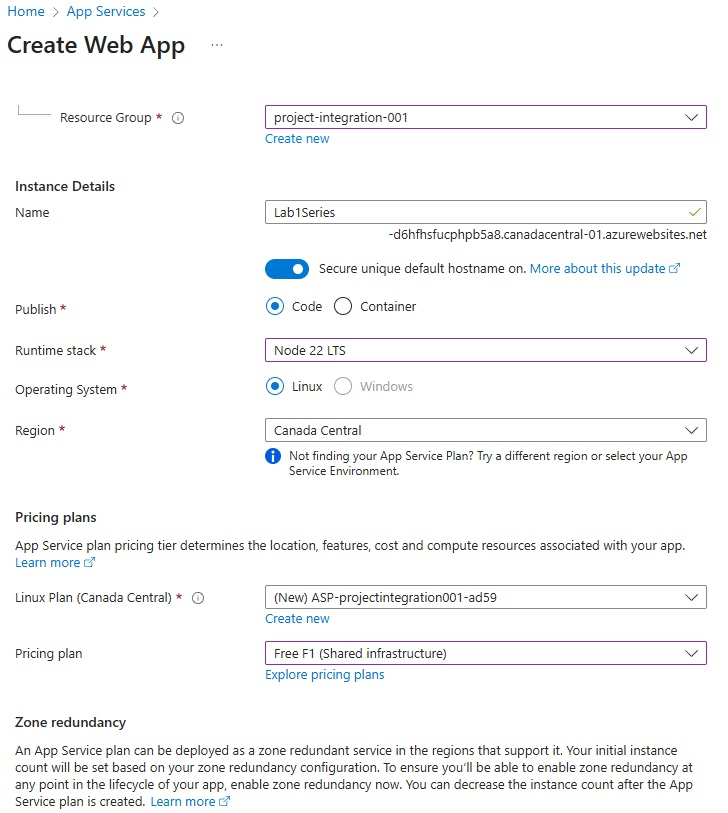

Once the deployment is completed, you will land in the main page of your WebApp.

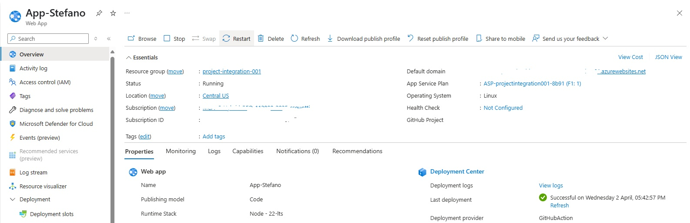


Now let's deploy our test REST API. In order to do that, let's click under **Deployment --> Deployment Center**.
For this lab, I used my personal GitHub Account and I connected it directly to my Web App for CI/CD.
if you have a personal Github Account, you can simply create a Repo with the code provided and connect your GitHub Account to your Web App. 
Github Actions will do the job for you.

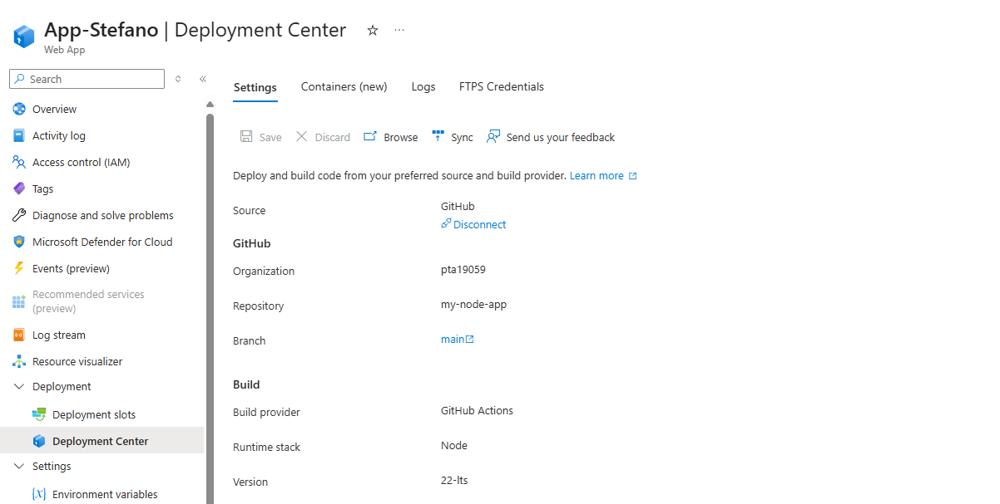

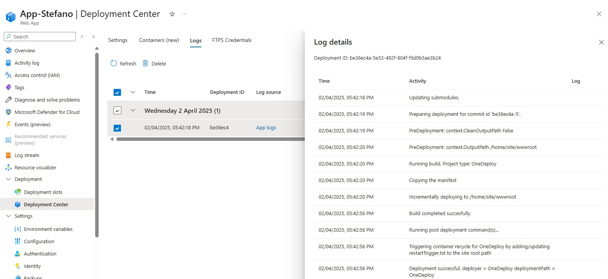

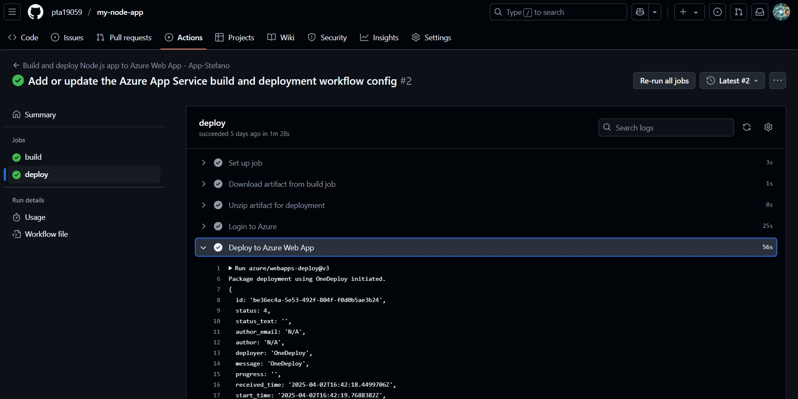

To test your REST API, open a new page in your browser and copy your Default Domain and add **/api/users/123** at the end.

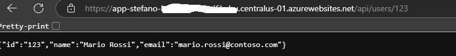
Now we're ready to provision our **API Management Service**.

## Deploy API Management Service 

## Steps

In Azure, find in the Search Bar **API Management Service** and click on it.

Click **Create** and let's start to create the Service.

Select the Resource Group (project-integration-001), Region and provide a Resource Name.

For the Organization name / Administrator email, provide a name and an email (these fields are used for the Developer Portal and for email notifications).

Pricing Tier , for this Lab use **Developer (no SLA)**.

Finally, click **Review + create**.

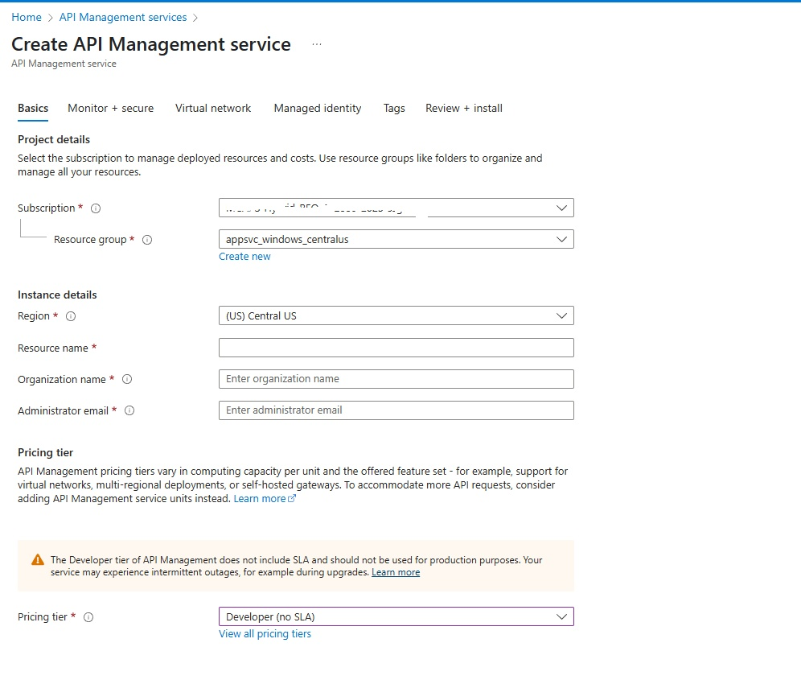

When deployment is completed (you have to wait a couple of minutes), you will land to the APIM main page.

We are now going to create a simple GET API (GET UserId) where when we input a userID we'll get a response from our backend (our App Service) with the JSON tested before in our Web App.

Under **APIs** -- Click **APIs** and then **Add API** . Select then **HTTP Manually define an HTTP API**.

In the Window of the creation of the HTTP API, click the tab **Full**.

Input a Display name and in the Web Service URL use the Default domain name of your App Service deployed (https://xxxxxxxxxxxxxx.centralus-01.azurewebsites.net).

URL Scheme leaves **HTTPS**.

In the API URL Suffix, input **api/users**.

Leave the Default Settings and then click Create.

Once the API is deployed, in the Settings Tab deselect for now **Subscription required**.

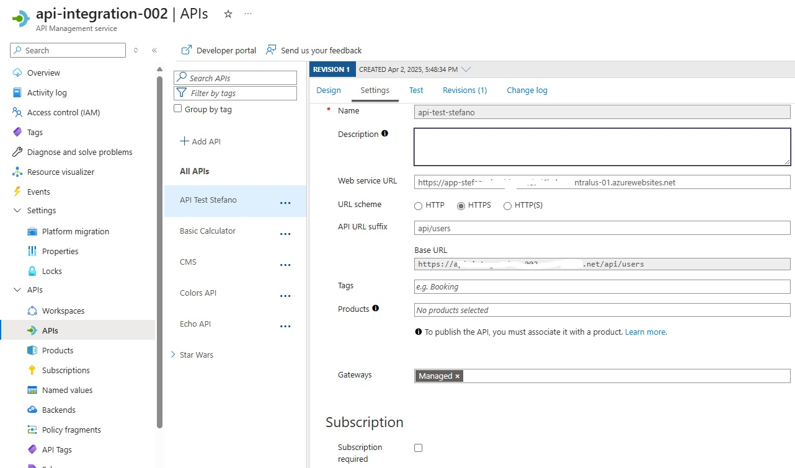

In the Design tab, add an operation and call it **GET UserId**.

URL select GET and input **/{UserId}**.

Click **ALL Operations**, and in the inbound processing tab add this policy (remember to replace the backend service base-url with yours Domain name of your App Service)


```
<policies>
    <!-- Throttle, authorize, validate, cache, or transform the requests -->
    <inbound>
        <base />
        <set-backend-service base-url="https://xxxxxxxxxxxxxxxxxxx.centralus-01.azurewebsites.net" />
        <rewrite-uri template="/api/users/{userId}" />
    </inbound>
    <!-- Control if and how the requests are forwarded to services  -->
    <backend>
        <base />
    </backend>
    <!-- Customize the responses -->
    <outbound>
        <base />
    </outbound>
    <!-- Handle exceptions and customize error responses  -->
    <on-error>
        <base />
    </on-error>
</policies>

```
Click **Save**.

In the Backend, Select **HTTP(s) endpoint** and add your Service URL that will be your domain name of your App Service ).

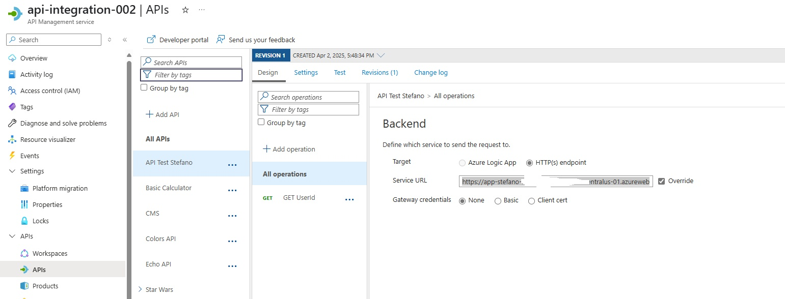

At the end, all settings should looks like as per image below:

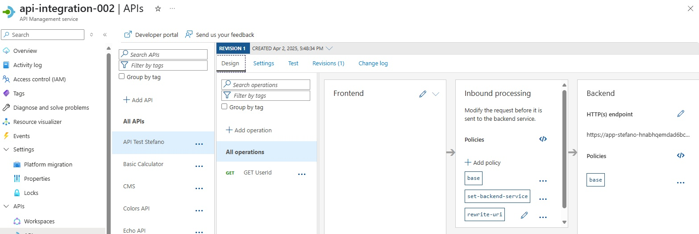


Now we need to test our API in APIM.

Click on **Test** Tab , and input in UserId 123. 
When you click **Send** you should receive **200 OK** with the JSON message.

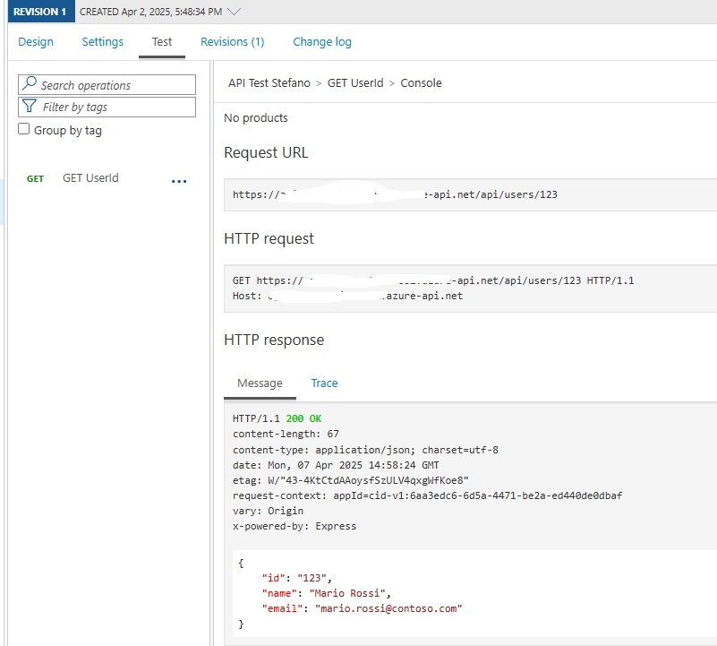 


Now we have set up **API Management Service** and **App Service**. Let's now as a final step to deploy **Azure Front Door** in front of APIM.


## Deploy Azure Front Door

## Steps

We're going to deploy Azure Front Door but for the scope of this Lab we'll deploy it using basic configurations. 
We'll explain as well how to put some common Best Practice to secure the service.

In your search bar, find out **"Front Doors"** and when you find it click on **Create** to start the provisioning.
For this Lab, let's keep the default Settings and **click Continue to create a Front Door**.

Select **Resource Group** (project-integration-001).

Provide a name for your Front Door Service.

Tier, select **Standard** for this Lab.

Endpoint name - Provide a name (apim-gateway, etc.). it will be generated the Endpoint hostname.

Origin Type, select **API Management**.

Origin host name, select your APIM service from the list.

Click **Review + create**.

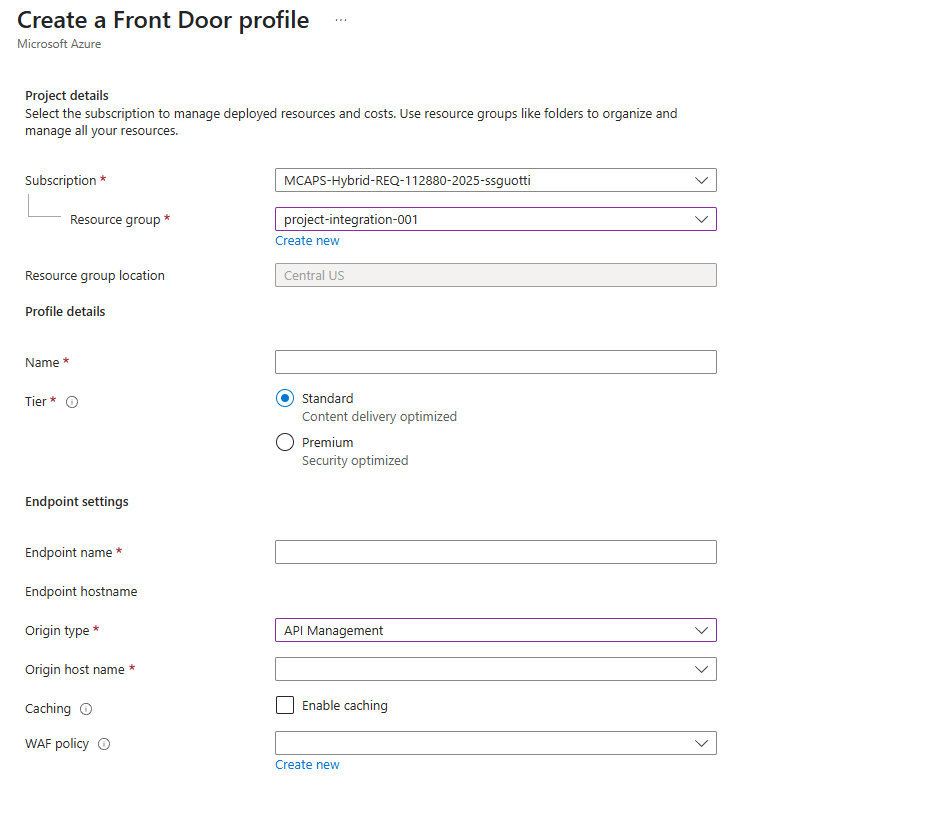

In the main page, once the deployment is completed take note about of the Endpoint hostname. We will use later to complete our lab.

Click on the **Origin groups** tab on your left, verify in the **Origin host name** there is your APIM Service and in the Health Probes complete all the fields as per image below:

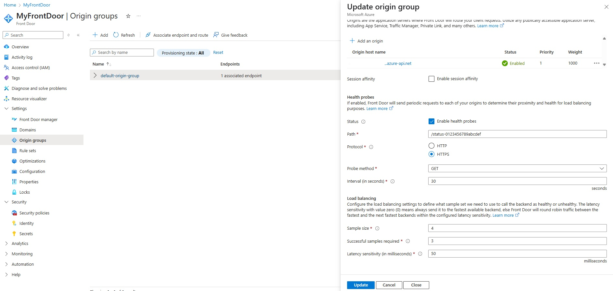

Then, click **Update**.


Open a new browser, paste your endpoint hostname adding **api/users/123** at the end (it should be https://xxxxxxxxxxxxxx.b01.azurefd.net/api/users/123) and if you see the JSON good job you have completed this Lab testing out Azure Front Door, APIM and App Service. 

**Well Done!**


