## Introduction

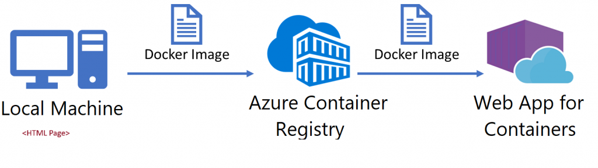

This lab demonstrates the process of containerizing a simple ***HTML web page** and deploying it to **Azure App Service**. 

The goal is to create a basic HTML page, package it within a **Docker container** that can run locally on a laptop, push the container image to **Azure Container Registry (ACR)**, and finally, deploy the application to **Azure App Service** using the container image. 

This exercise showcases a common workflow for modern web application development and deployment, emphasizing the benefits of containerization for portability and consistency across different environments.

Here's a breakdown of the key elements included:

**Purpose**: Clearly states the objective of the lab.

**Steps**: Outlines the main stages of the lab:
- Creating the HTML page.
- Containerizing it with Docker.
- Pushing the image to ACR.
- Deploying to Azure App Service (using Container Feature).
  
**Benefits**: Highlights the advantages of containerization (portability, consistency).

**Target Audience**: Implies a target audience of developers interested in learning containerization and cloud deployment.

## Prerequisites

- [Docker Desktop](https://www.docker.com/products/docker-desktop/)
- [VSCode](https://code.visualstudio.com/)
- Create a **Resource Group** for your resources.


## Lab Steps 

First of all, clone this repo locally [html-container-lab](https://github.com/pta19059/html-container-lab).

This is a basically a simple HTML page that will be used for our Lab.

Next step is contanarizing it using Docker and nginx and have it running in our local system.

For this lab, there is already a Dockerfile prepared so you don't have to create one.

## Docker Commands

**Build the Image**

- Open a **Terminal** (VS Code one for example).

- Go to the directory you have cloned and where your Dockerfile resides.

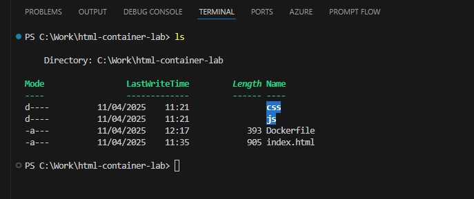

```
docker build -t docker-lab-html-container .

```
- **Run the Container**

```
docker run -d -p 8080:80 --name docker-lab-container-html docker-lab-html-container 

```

if you run **docker ps** in your terminal, you should find your container (id) up and running with the correct port mapping.

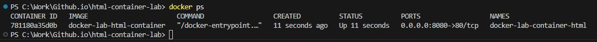 

Now you can open a browser and if you run **http://localhost:8080** you can see your webpage!

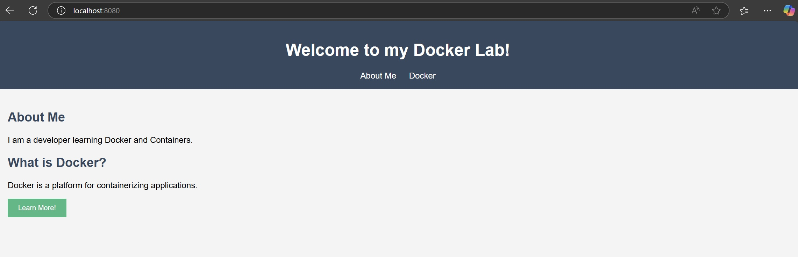


**Create an Azure Container Registry**

- Go to **Azure**.
- Search for **Container Registries**.
- Click **Create**.

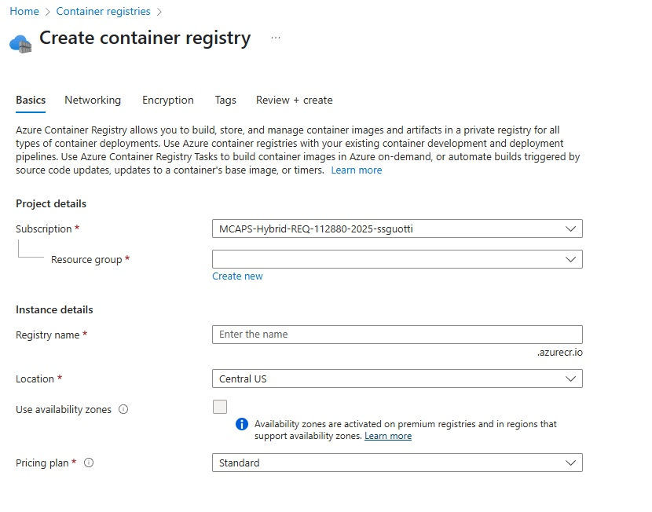

In the window that appear, select the **Resource Group** you have created and give a **name** of your registry.

Select **Location** and for this lab keeps as a **Pricing Plan - Standard.**

Then click **Review + create**.

**Docker Image built in ACR**

- Run **az acr login** command.
- 
```
az acr login --name xxxxxx

```
In the folder you have cloned, inside it run the below command to build the image but this time directly in ACR.

```
az acr build --registry <name> --image xxxxxxxx.azurecr.io/docker-lab-container-html:latest --platform linux/amd64 .

```

When the process is completed in **Services-Repositories** in ACR you should see your image.

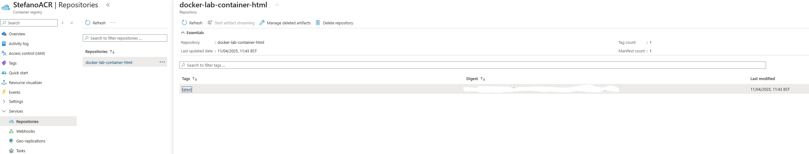


## Deploy the Container in Container Apps

Now it's the time to deploy our **Container** using the feature in place in **App Service**.

- Step 1: Create a **Linux plan** (if it doesn't already exist)

```  
  az appservice plan create --name myLinuxPlan --resource-group <name_RG> --sku B1 --is-linux

```  

You should see it inside your **Resource Group**.

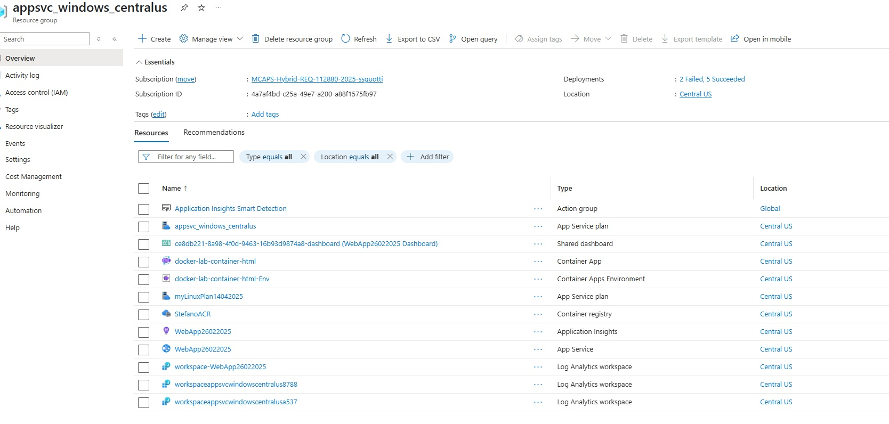

- Step 2: Create the **Web App**

``` 
  az webapp create --resource-group <name_RG> --plan <plan_name> --name <name_WebApp> --deployment-container-image-name xxxxxxxxxx.azurecr.io/docker-lab-container-html:latest

```

After a couple of minutes, you will have your WebApp deployed in App Service.

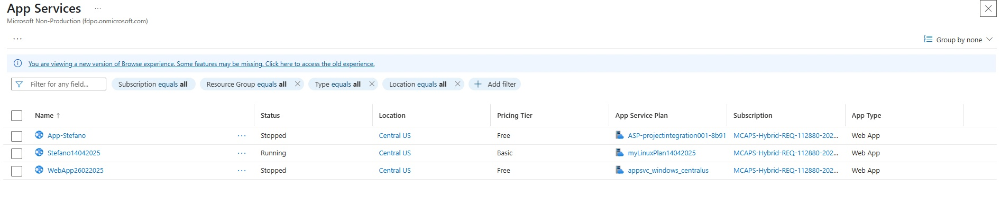

- Click the name of the **WebApp** that you have deployed.

- Click on **Deployment** --> **Deployment Center**.

Now you'll have some **Warnings** that are displayed.

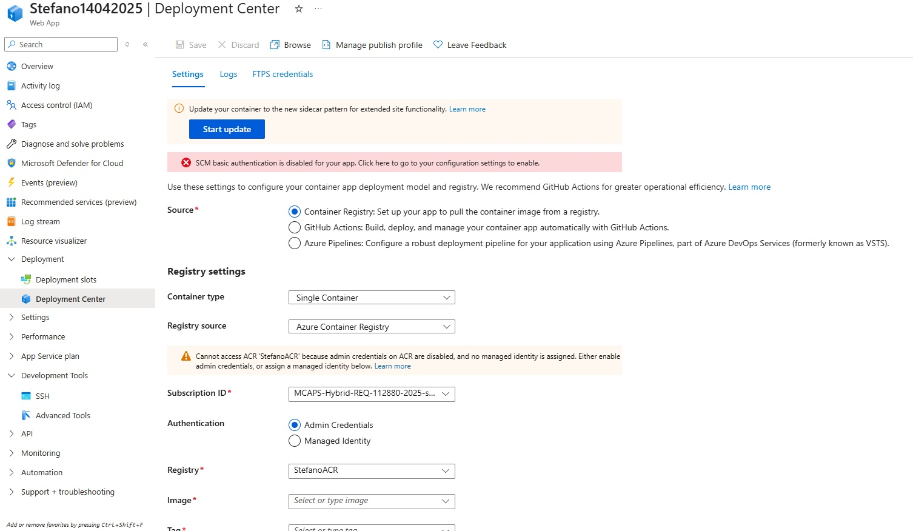

- **Source** - keep **Container Registry** flagged.

- Leave **Container type** as **Single Container** and keep as a Registry source **ACR**.

- In the **Registry Settings**, select **Managed Identity** .

- **Identity** must be **System assigned**.

You should see the fields populated with your **Registry name**,**Image** and **tag** automatically.

Using these settings, we configure our container app deployment model and registry.

- Click **Save**.

- Now click on **Start Update** to update our container to the new sidecar pattern for extended site functionality.

- In the window that will appear, input **80** in the port field and click **Update**. Leave the default settings.

- Click  **Restart** to update your app.

Now you will have your container in the list, but it appears with a Status **Not available**. 

Wait a couple of minutes then refresh the page and you'll see it up and running.

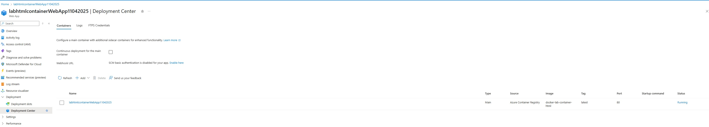

Now if you open a browser and run the Default Domain (https://xxxxxxxxxxxxxx.azurewebsites.net) you will have your HTML Page up and running!

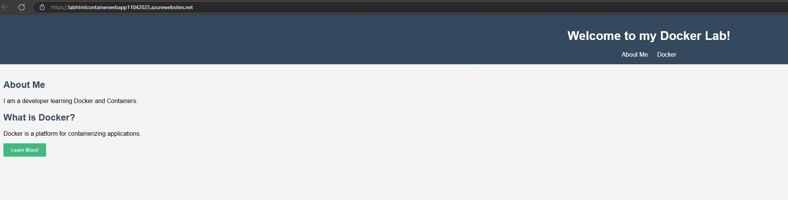 

**Well Done!** You have now completed this simple lab and yout obtained the basic knowledge to migrate a **simple HTML Page** in **App Service** using the **Container feature**!


