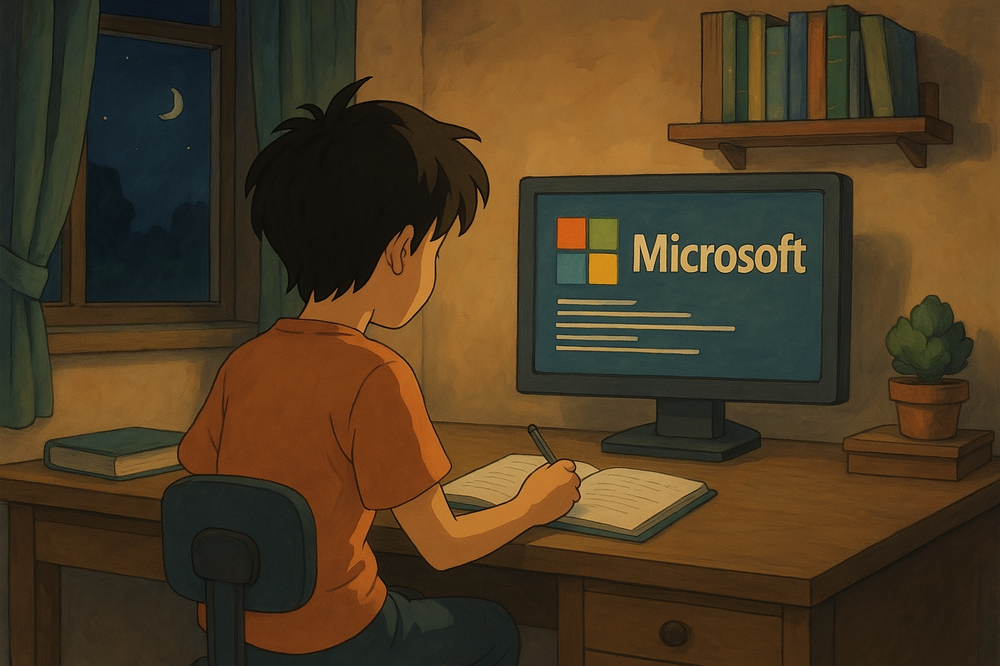

# Welcome to Azure Labs - Episodes

Hi there!

Welcome to this comprehensive series of **hands-on labs** designed to help you understand and master the various **Azure services**. Whether you're a developer, architect, or IT professional, these labs will provide you with practical experience and knowledge to effectively use Azure in a variety of real-world scenarios.

Throughout these labs, you'll explore different **Azure services**, learn how to integrate them into your projects, and get hands-on practice with common use cases that our customers often encounter. 
By the end of this series, you'll be well-equipped to leverage Azure's powerful capabilities to build, deploy, and manage applications and services in the cloud.

Dive in and enjoy the learning journey!

## Prerequisites 

The following are required to complete the labs:

 **Azure Subscription** -  [pricing](https://azure.microsoft.com/pricing/details/container-apps/)
 **Azure CLI** - this can be used either:
  * locally [install instructions](https://docs.microsoft.com/cli/azure/install-azure-cli).
  * accesed via the [cloud Shell](https://shell.azure.com).
  * Visual Studio Code - [VSCode](https://code.visualstudio.com/)

## Labs Episodes

| Resource |
|---|
| [Azure Front Door - APIM - App Service - Lab1](https://pta19059.github.io/Labs/AzureFrontDoorAPIMAppServiceLab1) |